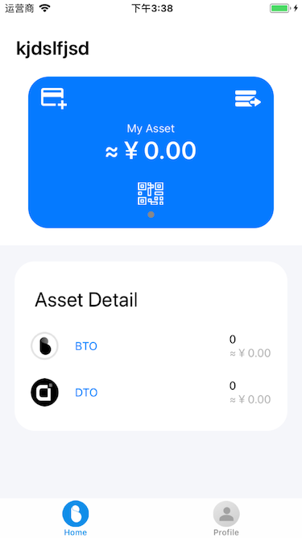

# wallet of Bottos

### LoginView

### HomeView
    

## Wallet Functions

- Create Wallet
- Delete Wallet
- Transaction
- Check History Of Transaction
- Check Balance Of Wallet

## Pay attention to the use of your wallet

After you have created your wallet, please backup and properly keep your keystore file and password. Once your keystore file or password is lost, you will not be able to recover your personal assets.Also，Please do not transfer your keystore file and password on the network to prevent network hackers from stealing it

## License

GPLv3 licensed.